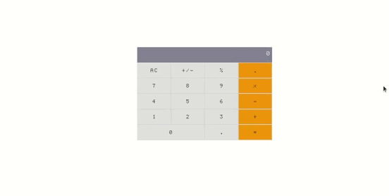

# Math Magicians

> "Math magicians" is a website for all fans of mathematics. It is a Single Page App (SPA) that allows users to:  

- Make simple calculations.
- Read a random math-related quote.





## Built With

- React
- git
- Javascript
- CSS


## Live Demo


[Live Site](https://taher-web-dev.github.io/Math-Magicians/)

## Getting Started


To get a local copy up and running follow these simple example steps.


### Setup

To get a local copy up and running follow these simple example steps.
- Open terminal
- Clone this project by the command: 

```
$ git clone git@github.com:Taher-web-dev/Math-Magicians.git
```

- Then go to the main folder using the next command:

```
$ cd Math-Magicians/
```

- Finally, install npm , then run <b> npm start </b> in your console.

### Prerequisites

- IDE to edit and run the code (We use Visual Studio Code 🔥).
- Git to versionning your work.


### Usage

- Web developement practioner
- For anyone who wants to create a meals application.

👤 **Taher Haggui**

- GitHub: [@Taher-web-dev](https://github.com/Taher-web-dev)
- Linkedin:[@TaherHaggui](https://www.linkedin.com/in/taher-haggui-66b5a6198/)


## 🤝 Contributing

Contributions, issues, and feature requests are welcome!

Feel free to check the [issues page](../../issues/).

## Show your support

Give a ⭐️ if you like this project!

## Acknowledgments

- Hat tip to anyone whose code was used
- Inspiration
- etc

## 📝 License

This project is [Microverse](https://www.microverse.org/) licensed.